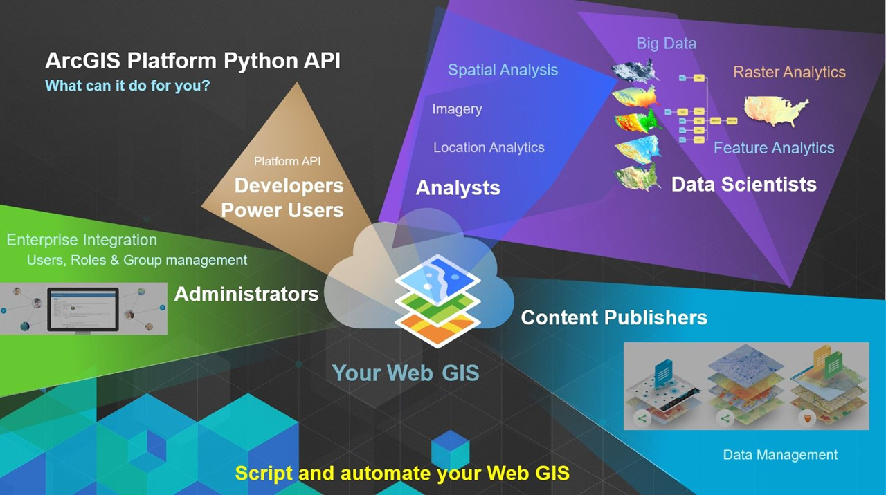

# Modul Pelatihan ArcGIS Notebook 

## Daftar isi

[toc]

***


## Pengantar

### Tentang Panduan ini

Panduan ini dibuat untuk memberikan panduan dasar mengenai ArcGIS Notebook untuk pemula. Saat ini ESRI telah menyediakan panduan yang cukup lengkap tentang ArcGIS Notebook, ArcPy dan ArcGIS API for Python, sehingga dokumen ini hanya berfungsi sebagai pengantar ringkas bagi pemula yang ingin memulai bekerja dengan ArcGIS Notebook. Rujukan yang lebih lengkap pada berbagai dokumentasi yang disediakan oleh ESRI akan diberikan sepanjang panduan singkat ini. 

### Jadwal Pelatihan

Apabila diberikan pada pelatihan dasar tentang ArcGIS Notebook, pembagian jadwal dari materi ini dapat dilakukan sebagai berikut:

**Hari 1: Review dan Pengenalan Konsep Python pada ArcGIS** 

|     Waktu     | Materi Pelatihan                                             |
| :-----------: | ------------------------------------------------------------ |
| 09.00 - 10.00 | Pendahuluan (Review Pemrograman Python dan modul-modul yang berguna) |
| 10.00 - 10.15 | *Break*                                                      |
| 10.15 - 12.00 | Pendahuluan (Python pada Ekosistem ArcGIS)                   |
| 12.00 - 13.00 | *ISHOMA*                                                     |
| 13.00 - 15.00 | Konsep ArcGIS Notebook Server (ArcGIS Notebook Server, ArcGIS Enterprise dan Jupyter) |
| 15.00 - 15.15 | *Break*                                                      |
| 15.15 - 16.00 | Konsep ArcGIS Notebook Server (ArcPy dan ArcGIS API for Python) |


**Hari 2: ArcGIS Notebook ** 

|     Waktu     | Materi Pelatihan                                             |
| :-----------: | ------------------------------------------------------------ |
| 09.00 - 10.00 | ArcGIS Notebook                                              |
| 10.00 - 10.15 | *Break*                                                      |
| 10.15 - 12.00 | Perintah-perintah ArcPy dan ArcGIS API for Python pada Notebook |
| 12.00 - 13.00 | *ISHOMA*                                                     |
| 13.00 - 15.00 | Manajemen Data menggunakan Notebook                          |
| 15.00 - 15.15 | *Break*                                                      |
| 15.15 - 16.00 | Latihan-Latihan                                              |


**Hari 3: Data Science dan Otomatisasi** 

|     Waktu     | Materi Pelatihan                                            |
| :-----------: | ----------------------------------------------------------- |
| 09.00 - 10.00 | Pengantar Data Science                                      |
| 10.00 - 10.15 | *Break*                                                     |
| 10.15 - 12.00 | Data Science Menggunakan Notebook (Grafik dan statistik)    |
| 12.00 - 13.00 | *ISHOMA*                                                    |
| 13.00 - 15.00 | Data Science Menggunakan Notebook (Analisis spasial dan 3D) |
| 15.00 - 15.15 | *Break*                                                     |
| 15.15 - 16.00 | Otomatisasi Notebook                                        |


### Lisensi Dokumen 

Dokumen ini dan latihan yang ada di dalamnya disusun di bawah panduan [Lisensi MIT](https://opensource.org/licenses/MIT). 

Dokumen ini ditulis oleh Dany Laksono untuk Pusat Data dan Teknologi Informasi (Pusdatin) Kementerian PUPR tahun 2020


### Lisensi Perangkat Lunak

Sebagian besar latihan pada dokumen ini menggunakan produk dari ESRI ArcGIS, dan mengikuti lisensi masing-masing produk yang terkait. Untuk latihan, [versi trial dari ArcGIS Online](https://www.esri.com/en-us/arcgis/products/arcgis-online/trial) meliputi semua produk yang bisa digunakan di dokumen ini kecuali pembahasan mengenai ArcGIS Notebook Server dan ArcGIS Enterprise. Di Indonesia, lisensi [ArcGIS Online dan ArcGIS Pro for Personal Use](https://esriindonesia.co.id/arcgis-for-personal-use) dapat diperoleh dengan harga yang cukup terjangkau.


### Daftar Latihan

Gunakan link berikut untuk langsung menuju ke daftar latihan pada modul ini.

[Latihan 1: Instalasi Jupyter Notebook](#==Latihan 1==: Membuat ArcGIS Notebook)

[Latihan 2: Memulai ArcGIS Notebook pada Jupyter Notebook di komputer lokal](#Latihan 2: Memulai ArcGIS Notebook pada Jupyter Notebook di komputer lokal)

[Latihan 3: Memulai ArcGIS Notebook pada ArcGIS Pro Python Command Prompt](#Latihan 3: Memulai ArcGIS Notebook pada ArcGIS Pro Python Command Prompt)

[Latihan 4: Memulai ArcGIS Notebook pada ArcGIS Online](#Latihan 4: Memulai ArcGIS Notebook pada ArcGIS Online)

[Latihan 5: Manajemen Data pada Portal](#Latihan 5: Manajemen Data pada Portal)

[Latihan 6: Analisis Stasistik Menggunakan Notebook](#Latihan 6: Analisis Stasistik Menggunakan Notebook)

[Latihan 7: Analisis Raster dengan ArcGIS Notebook](#Latihan 7: Analisis Raster dengan ArcGIS Notebook)

[Latihan 8: Mengakses WebMap dan WebScenes](#Latihan 8: Mengakses WebMap dan WebScenes)


<div style="page-break-after: always;"></div>

## Pendahuluan

Sebelum masuk lebih jauh mengenai Konsep dan dasar pengolahan data dengan ArcGIS Notebook server, terlebih dahulu akan diberikan pengantar dan review mengenai pemrograman Python, bagaimana Python digunakan pada ekosistem ArcGIS serta beberapa modul third-party Python yang berguna dalam pengolahan data.

### Review Pemrograman Python

Python merupakan bahasa pemrograman *General Purpose Language* aras tinggi, dan terinterpretasi (*interpreted*), serta salah satu bahasa pemrograman [paling populer saat ini](https://www.wired.com/story/python-language-more-popular-than-ever/). Sebagai bahasa pemrograman *general purpose*, Python dapat ditemukan pada pemrograman web, analisis data, pemodelan, visualisasi grafis, pembuatan game, dan lain sebagainya. Popularitas Python salah satunya didorong oleh komunitas yang cukup besar dan struktur bahasanya yang mudah dipahami, sebagaimana tercermin pada `Zen of Python`:

```markdown
The Zen of Python, by Tim Peters

Beautiful is better than ugly.
Explicit is better than implicit.
Simple is better than complex.
Complex is better than complicated.
Flat is better than nested.
Sparse is better than dense.
Readability counts.
Special cases aren't special enough to break the rules.
Although practicality beats purity.
Errors should never pass silently.
Unless explicitly silenced.
In the face of ambiguity, refuse the temptation to guess.
There should be one-- and preferably only one --obvious way to do it.
Although that way may not be obvious at first unless you're Dutch.
Now is better than never.
Although never is often better than *right* now.
If the implementation is hard to explain, it's a bad idea.
If the implementation is easy to explain, it may be a good idea.
Namespaces are one honking great idea -- let's do more of those!

```

Oleh penemunya, Guido van Rossum, Bahasa Python sendiri didesain agar menjadi kode yang sangat sederhana, mudah dibaca meskipun bagi mereka yang baru belajar, serta mampu menangani data dalam jumlah besar. Sebagai contoh, baris kode berikut: 

```python
x=[0]*10005
x[1]=1
for j in range(2,10001):
    x[j]=x[j-1]+x[j-2]  	# Fibonacci
print(x[10000])				# isi array ke 10.000
```

akan menampilkan bilangan Fibonacci ke 10.000 yang disimpan pada sebuah array. Hasil dari program tersebut adalah bilangan yang sangat panjang:

```markdown
33644764876431783266621612005107543310302148460680063906564769974680081442166662368155595513633734025582065332680836159373734790483865268263040892463056431887354544369559827491606602099884183933864652731300088830269235673613135117579297437854413752130520504347701602264758318906527890855154366159582987279682987510631200575428783453215515103870818298969791613127856265033195487140214287532698187962046936097879900350962302291026368131493195275630227837628441540360584402572114334961180023091208287046088923962328835461505776583271252546093591128203925285393434620904245248929403901706233888991085841065183173360437470737908552631764325733993712871937587746897479926305837065742830161637408969178426378624212835258112820516370298089332099905707920064367426202389783111470054074998459250360633560933883831923386783056136435351892133279732908133732642652633989763922723407882928177953580570993691049175470808931841056146322338217465637321248226383092103297701648054726243842374862411453093812206564914032751086643394517512161526545361333111314042436854805106765843493523836959653428071768775328348234345557366719731392746273629108210679280784718035329131176778924659089938635459327894523777674406192240337638674004021330343297496902028328145933418826817683893072003634795623117103101291953169794607632737589253530772552375943788434504067715555779056450443016640119462580972216729758615026968443146952034614932291105970676243268515992834709891284706740862008587135016260312071903172086094081298321581077282076353186624611278245537208532365305775956430072517744315051539600905168603220349163222640885248852433158051534849622434848299380905070483482449327453732624567755879089187190803662058009594743150052402532709746995318770724376825907419939632265984147498193609285223945039707165443156421328157688908058783183404917434556270520223564846495196112460268313970975069382648706613264507665074611512677522748621598642530711298441182622661057163515069260029861704945425047491378115154139941550671256271197133252763631939606902895650288268608362241082050562430701794976171121233066073310059947366875
```

Seluruh besaran bilangan tersebut dan algoritma hitungannya dapat ditangani dengan baik oleh Python tanpa banyak kesulitan. Sifat dinamis Python inilah yang menyebabkannya banyak digunakan sebagai *wrapper* untuk berbagai bahasa lain karena kemampuannya dalam melakukan abstraksi konsep yang rumit menjad bahasa yang mudah dipahami. Oleh karena itu, Python sering dijuluki sebagai **glue language**, dimana berbagai data dari berbagai sumber dapat dipertemukan pada platform yang sama.

 Selain beberapa hal yang disebutkan di atas, hal lain yang membuat Python sangat *powerful* adalah dukungan **libraries**. Modularitas Python memungkinkan pengembangan aplikasi untuk berbagai keperluan. Seorang pengembang Bahasa Python dapat dengan mudah mengkombinasikan berbagai *library* dari ratusan ribu modul Python yang tersedia untuk berbagai macam keperluan. 

Untuk meringkas, berikut adalah beberapa poin karakteristik Python sebagai bahasa pemrograman *General Purpose*:

* Merupakan bahasa pemrograman *interpreted,*bukan *compiled* sebagaimana Bahasa C
* Memiliki berbagai modul *built-in* serta *third-party* yang memperkaya kemampuan Python pada berbagai bidang 
* Python menggunakan konsep *Dynamic Typing*, dimana tipe data sebuah variabel tidak perlu didefinisikan pada saat inisiasi.
* Deklarasi indentifier pada Python bersifat *Case Sensitive*: huruf besar dan huruf kecil diperlakukan sebagai dua karakter yang berbeda
* Python dapat berfungsi sebagai *wrapper* untuk berbagai bahasa aras menengah atau rendah, seperti C atau C++. Dengan demikian, Python dapat berfungsi sebagai 'jembatan' antara kecepatan aplikasi yang dihasilkan dan kemudahan dalam penyusunan kode program
* Block pada Python menggunakan indentasi. Hal ini membuat tampilan kode Python lebih mudah dibaca dan dipahami bahkan oleh pemula sekalipun
* Python merupakan *Glue Language* yang mampu mengumpulkan data dari berbagai sumber (misalnya API) dan melakukan analisis terhadap data tersebut


Berikut adalah review beberapa konsep dasar Python berikut contohnya:

1. **Import statements**

   Digunakan untuk memanggil library lain yang berisi beberapa modul (class pada Python).

   ```python
   >>> import arcpy				# Panggil seluruh modul pada library arcpy
     								# untuk memanggil modul pada script, gunakan:
       							#  'arcpy.mp'
   >>> import arcpy, os, sys		# Panggil beberapa library sekaligus
   >>> from arcpy import mp		# Hanya memanggil modul 'mp' dari library arcpy
   >>> from arcpy import mp, da	# Memanggil modul 'mp' dan 'da' dari library arcpy
   >>> from arcpy import *			# !Perlu dihindari!
   								# memanggil seluruh modul pada library arcpy
   								# sebagai native module. untuk memanggil modul, 
           						# nama modul dapat langsung digunakan ('da')
   ```

2. **Deklarasi variabel**

   Variabel pada Python bersifat *Dynamic Typing*: tipe data tidak perlu disebutkan secara eksplisit pada saat inisiasi. Python akan secara otomatis mengenali dan menetapkan tipe data untuk tiap variabel. Identifier pada nama variabel bersifat *Case Sensitive*, yaitu huruf besar dan kecil dianggap sebagai karakter yang berbeda

   ```python
   # Deklarasi variabel. Dua buah variabel berbeda
   >>> shapefileName = ‘batas_desa.shp’ 
   >>> ShapefileName = ‘batas_merapi.shp’
   
   # Tipe data dikenali pada saat inisiasi
   >>> x = 1 	# type of integer 
   >>> x = ‘1’ 	# type of string
   
   # Deklarasi beberapa variabel sekaligus
   >>> a, b, c = 5, 3.2, "Hello" 	# Multiple variables
   >>> x = y = z = "isinya sama"
   
   # Operasi pada tipe data yang berbeda tidak diizinkan
   >>> x = 1 + '2'
   Traceback (most recent call last):
     File "<stdin>", line 1, in <module>
   TypeError: unsupported operand type(s) for +: 'int' and 'str'
   
   ```

3. **Tipe Data**

   Berikut adalah beberapa tipe data yang dikenali oleh Python:

   | Tipe Data      | Syntax                             |
   | -------------- | ---------------------------------- |
   | Text Type      | `str `                             |
   | Numeric Types  | `  int, float, complex  `          |
   | Sequence Types | `  list, tuple, range  `           |
   | Mapping Type   | `dict  `                           |
   | Set Types      | `  set, frozenset  `               |
   | Boolean Type   | `  bool  `                         |
   | Binary Types   | `  bytes, bytearray, memoryview  ` |

   Tipe data yang penting untuk diingat antara lain adalah tuple, list dan dictionary. Contoh penggunaannya adalah [sebagai berikut](http://sthurlow.com/python/lesson06/):

   ```python
   # Deklarasi Tuple
   >>> bulan = ('Januari','Februari','Maret','April','Mei','Juni',
   'Juli','Agustus','September','Oktober','November','  Desember')
   # memanggil tuple. Urutan
   >>> bulan[0]
   'Januari'
   # tuple bersifat 'immutable': isinya bersifat tetap, tidak dapat berubah
   
   # Deklarasi List
   >>> kucing = ['Tom', 'Snappy', 'Kitty', 'Jessie', 'Chester']
   # menambah kucing baru
   >>> kucing.append['Garfield']
   >>> print(kucing)
   ['Tom', 'Snappy', 'Kitty', 'Jessie', 'Chester', 'Garfield']
   # list bersifat mutable: anggotanya bisa ditambah dan dikurangi
   
   # Deklarasi Dictionary
   >>> pegawai = {
       'Arik Alamsyah':8806336,
       'Bustanul Basami':6784346, 
       'Cici Cahyati':7658344,
       'Donnie Darko':1122345
   }
   # menambah pegawai baru
   >>> pegawai['Emet Egiarsa'] = 223124
   >>> print(pegawai)
   {'Arik Alamsyah': 8806336, 'Bustanul Basami': 6784346, 'Cici Cahyati': 7658344, 'Donnie Darko': 1122345, 'Emet Egiarsa': 223124}
   # dictionary terdiri dari 'key' dan 'value', dan bersifat mutable
   ```

   Python menerapkan *zero-based indexing* untuk ketiga tipe data di atas, sehingga elemen pertama dapat diakses melalui **indeks nol [0]**.

4. **Pernyataan syarat (conditional)**

   Contoh pertama dari penggunaan pernyataan kondisional pada Python adalah dengan menggunakan ```if```:

   ```python
   >>> z = 4
   >>> if z > 70:
   ...     print('Kondisi ini salah')
   ... elif z < 7:
   ...     print('Kondisi ini benar')
   ```

   Selain melalui ==conditional if== , alur program pada Python juga dapat dikontrol melalui ==exception handling==:

   ```python
   try:
       age=int(input('Masukkan usia anda: '))
   except:
       # akan dipanggil jika try menghasilkan exception
       print ('Anda harus memasukkan bilangan bulat')
   else:
       # akan dipanggil jika tidak ada error
       if age <= 21:
           print('Anda masih muda')
       else:
           print('Anda tidak muda lagi')
   ```

   Blok pernyataan pada Python dinyatakan dengan ==indentasi==: pernyataan pada satu blok diawali dengan spasi pada blok yang sama.

5. **Pernyataan perulangan (loop)**

   Pernyataan perulangan (loop) pada Python diberikan dengan menggunakan syntax ```for ``` atau ```while```. Sama seperti pada pernyataan lain pada Python, penanda blok pada perulangan adalah ==indentasi==

   

   

   Contoh perulangan menggunakan ```while``` adalah sebagai berikut:

   ```python
   a = 0
   # indentasi digunakan untuk menyatakan blok
   while a < 10:
       a = a + 1
       print a
   ```

6. **Fungsi (*function*)**

   Fungsi pada Python dinyatakan dengan *keywords* ``def``. Sebuah fungsi dapat menerima argumen (***args**) atau keyword-argument (** **kwargs**) yang dapat dipanggil kapanpun diperlukan. 

   

   Contoh penggunaan *args dan *kwargs adalah seperti berikut:

   ```python
   # Memanggil fungsi dengan argumen
   >> def func(name, job):
   ...    print(name, 'is a', job)
   # memanggil fungsi dengan argumen
   >>> func('Bob', 'developer')
   
   # Memanggil 'keywords armuments'
   def print_arguments(**kwargs):
       print(kwargs)
   
   print_arguments(name='Bob', age=25)
   
   ```


Sebagai Bahasa Pemgrograman yang cukup *mature*, ekosistem modul pada Python memungkinkan penggunaan bahasa ini untuk berbagai keperluan. Sebagai contoh, untuk keperluan *Data Science,* Python menyediakan berbagai modul mulai dari antarmuka interaktif seperti Jupyter Notebook, Library untuk manipulasi data seperti Pandas, sampai modul visualisasi seperti Seaborn. Kombinasi berbagai modul ini memudahkan pengguna ketika bekerja dengan data dari berbagai sumber pada satu lingkungan pemrograman yang sama.

 

Berikut adalah contoh sederhana penggunaan beberapa modul Python seperti `pandas`, `numpy`, `matplotlib` dan `seaborn` untuk mengolah data tabular dan menampilkan grafik:

```python
import pandas as pd
import numpy as np
import matplotlib.pylab as plt
import seaborn as sns
 
# Create dataframe
df = pd.DataFrame({
'x': [1, 1.5, 3, 4, 5],
'y': [5, 15, 5, 10, 2],
'group': ['A','other group','B','C','D']
})
 
sns.regplot(data=df, x="x", y="y", fit_reg=False, marker="+", color="skyblue")
plt.show()

```


Sebagai bahasa terinterpretasi, Python dikenal memiliki kecepatan yang [lebih lambat](https://www.monterail.com/blog/is-python-slow) dibandingkan dengan bahasa terkompilasi seperti C++. Meskipun demikian, kemampuan Python sebagai *Swiss-Army Knife of Programming Language* dan kemudahan bahasanya menyebabkan Python banyak digunakan dalam bidang Data Science, termasuk untuk pengolahan data spasial.


### Pemrograman Python pada ArcGIS

Python telah dikenal sebagai bahasa pengantar (*wrapper*) untuk berbagai fungsi pada lingkungan ArcGIS. Pada ArcMap, misalnya, digunakan Python versi 2.7 sebagai bahasa pengantar untuk fungsi-fungsi pada ArcToolbox. Python juga dapat langsung diakses dengan menggunakan Python Console yang juga tersedia pada ekosistem ArcMap.


Dengan datangnya periode [End of Life (EOL) dari Python 2.7](https://www.python.org/doc/sunset-python-2) pada awal tahun 2020, penggunaan Python pada ekosistem ArcGIS diperbarui dengan adanya ArcGIS online dan ArcGIS Pro. Dukungan Python 3.x pada ArcGIS Pro dan ekosistem ArcGIS Online dan ArcGIS Enterprise secara umum memungkinkan pengolahan data spasial untuk dilakukan secara terintegrasi dengan modul-modul Python lainnya. ArcGIS Pro bahkan memiliki pengaturan *Python Environment* dan *Package Manager* nya sendiri, sehingga tiap analisis dapat dilakukan dengan menggunakan beberapa modul Python yang berbeda. Gambar di bawah adalah Python Package Manager yang terdapat pada ArcGIS Pro, dan menunjukkan dua buah environment Python yang berbeda berikut dengan modul-modul (*packages*) yang tersedia di dalamnya.


Berbicara tentang *Interactive Python environment*, ArcGIS Pro dan juga ArcGIS Online/Enterprise juga telah memiliki antarmuka Jupyter Notebook yang terintegrasi dengan fungsionalitas lain baik pada versi Desktop maupun Online, seperti Map Canvas dan Analysis Toolbox pada ArcGIS Pro melalui modul `ArcPy`. Pada ArcGIS Online/ArcGIS Enterprise, ArcGIS Notebook dilengkapi dengan modul `ArcGIS API for Python` yang merupakan *wrapper* untuk berbagai fungsi analisis maupun administratif dari ekosistem ArcGIS tersebut.


Untuk penggunaan Python sebagai perangkat *Spatial Data Science,* ArcGIS menyediakan integrasi penuh pada modul Pandas dalam bentuk [Spatial DataFrame (SDF)](https://developers.arcgis.com/python/guide/introduction-to-the-spatial-dataframe/). SDF merupakan format dataframe Pandas yang telah terintegrasi penuh dengan kemampuan pengolahan data spasial, dan merupakan bagian dari modul ArcGIS API for Python yang akan dibahas lebih jauh pada Bagian IV dari modul ini.Lebih jauh, modul ini akan membahas implementasi Python pada ekosistem ArcGIS, khususnya dalam bentuk ArcGIS Notebook yang menggunakan ArcGIS API for Python dan ArcPy untuk analisis dan visualisasi data spasial.


<div style="page-break-after: always;"></div>


## Bagian I: Konsep ArcGIS Notebook Server

### I.1. ArcGIS Enterprise dan ArcGIS Notebook Server 

ArcGIS Enterprise dan ArcGIS Notebook Server merupakan dua dari beberapa produk terbaru dalam lini produk ArcGIS yang dirilis oleh ESRI. **ArcGIS Enterprise** dibangun untuk menjawab kebutuhan akan adanya *on-premise* Enterprise GIS yang dapat digunakan dalam suatu organisasi besar untuk menyelesaikan permasalahan sesuai kebutuhan. ArcGIS Enterprise pada dasarnya merupakan *upgrade* dari berbagai produk ArcGIS yang sudah ada sebelumnya, seperti ArcGIS Server, Portal for ArcGIS, ArcGIS Data Store dan ArcGIS Web Adaptor.


**ArcGIS Notebook Server** merupakan perangkat server pada ArcGIS Enterprise yang berfungsi untuk menyediakan kapabilitas pengolahan data melalui Jupyter Notebook. Dengan kata lain, ArcGIS Notebook server merupakan *host* dari ArcGIS Notebook yang pada gilirannya merupakan antarmuka Jupyter Notebook untuk melakukan berbagai fungsi yang didukung melalui ArcPy dan ArcGIS API for Python.

 

Pada infrastruktur ArcGIS Enterprise, ArcGIS Notebook Server mengalokasikan resource pada server untuk digunakan dalam pengolahan data dari Jupyter Notebook melalui beberapa *container* yang berjalan pada Docker Engine. ArcGIS Web Adaptor berfungsi sebagai *load balancer* untuk mengatur beban komputasi dari beberapa pengguna yang mengakses atau membuat Notebook pada ArcGIS Notebook sehingga semua pengguna memiliki alokasi *kernel* yang cukup untuk menjalankan notebook tersebut dan melakukan berbagai analisis di dalamnya.


### I.2. Jupyter Notebook

Penjelasan mengenai Jupyter Notebook perlu dimulai dari konsol **IPython (*Interactive Python*)**. IPython merupakan konsol interaktif yang menyediakan shell REPL (*Read-Evaluate-Print-Loop*) untuk scripting bahasa Python. Konsep penggunaan IPython adalah menyediakan fungsi scripting, visualisasi sekaligus debugging yang lebih mudah bagi pengguna khususnya dalam penggunaan Python untuk keperluan pengolahan data dan penyajian hasil analisis. Visualisasi yang dihasilkan dari analisis ini dapat langsung ditampilkan menggunakan GUI Toolkits, sehingga pengguna tidak perlu melakukan pengaturan khusus terlebih dahulu sebelum dapat membuat sebuah grafik plot, misalnya. IPython juga memperkenalkan konsep **kernel** untuk dalam scripting Python interaktif, dimana pembagian *computing resource* dilakukan di belakang layar sehingga tiap sesi *scripting* dapat berjalan secara simultan dengan meminimalisir kekurangan alokasi memory.


**Jupyter Notebook** merupakan suksesor dari IPython, dimana tiap blok perintah diwakili oleh satu **cell**. Apabila IPython mengelompokkan tiap baris dalam satu kali eksekusi perintah, maka Notebook membuat kelompok-kelompok perintah ini dalam bentuk cell yang dapat dijalankan pada beberapa baris perintah sekaligus.


File yang dibuat pada Jupyter Notebook menggunakan ekstensi ***.ipynb**, format JSON berisi tiap cell yang merupakan baris **perintah Python**, **Markdown/Teks** atau perintah **shell** (terminal). Format ini memudahkan sebuah **notebook** untuk dipindahkan ke perangkat lain. Sebuah notebook juga dapat berfungsi sebagai *buku catatan* karena memuat baris kode dan keterangan yang diperlukan dalam bentuk [Markdown](https://github.github.com/gfm/).

Beberapa perbaikan antarmuka diberikan oleh **Jupyter Lab** yang merupakan penerus dari Jupyter Notebook. Kelebihan Jupyter Lab adalah antarmukanya yang bersifat lebih fleksibel, dengan pengaturan tab untuk membuka beberapa notebook sekaligus, serta tampilan output dan editor kode yang dapat diatur dengan mudah.


Selain Jupyter Notebook dan Jupyter Lab, terdapat beberapa implementasi lain untuk IPython Notebook. Beberapa yang paling populer diantaranya adalah:

* [Google Colab](https://colab.research.google.com/)
* [Kaggle](https://www.kaggle.com/kernels)
* [Binder](https://mybinder.org/)
* [Azure Notebooks](https://notebooks.azure.com/) (akan diistirahatkan oleh Microsoft)
* [Databricks](https://databricks.com/try-databricks)

**Google Colab**, seperti yang tampak pada gambar di bawah ini, merupakan sebuah platform yang cukup mumpuni untuk keperluan analisis dan visualisasi data dengan menggunakan Jupyter Notebook. Google Colab disokong oleh kemampuan *GPU processing* yang disediakan oleh Google, sehingga dapat digunakan untuk melakukan pengolahan data spasial dalam jumlah besar, misalnya untuk keperluan Deep Learning. Meskipun demikian, terdapat beberapa kekurangan dari Google Colab dibandingkan dengan Jupyter Notebook untuk menjalankan fungsi analisis data spasial dengan `ArcGIS API for Python`. Diantaranya adalah dukungan untuk library plotting yang digunakan oleh ArcGIS API, seperti pembuatan peta *inline*.


**Jupyter Notebook** dan **Jupyter Lab** dapat diinstall pada komputer sebagai bagian dari ==Conda Package Manager==, yaitu Anaconda dan Miniconda. ==Anaconda== merupakan paket terintegrasi yang lengkap: berisi ratusan modul yang sudah terinstall berikut ribuan modul lain yang dapat diinstall menggunakan `conda`. Selain Jupyter Notebook dan Jupyter Lab, Anaconda juga dilengkapi dengan antarmuka untuk berinteraksi dengan bahasa lain, semisal R, serta perangkat pengolahan data dan visualisasi *out-of-the-box*. Adapun ==Miniconda,== seperti namanya, merupakan versi yang lebih sederhana dari Anaconda. Miniconda hanya memuat modul-modul penting (*base modules*) Python dan tidak menyediakan antarmuka *out-of-the-box* untuk menjaga agar ukuran instalasinya tetap kecil. Meskipun demikian, modul-modul tambahan dapat diinstall dengan mudah menggunakan perintah `conda`.


Diantara keuntungan dari penggunaan Anaconda dan Miniconda sebagai package manager adalah kemampuan untuk mengatur *Python Environment*.  Dengan jumlah modul yang mencapai ribuan, tentunya pada penggunaan berbagai modul ini memiliki potensi inkompatibilitas yang dapat merusak seluruh ekosistem Python lainnya. Untuk itu, tiap lingkungan *scripting* pada Python dapat dipisahkan pada **Python Environment** yang berbeda. Bukan hanya modul, tiap environment juga dapat memiliki versi Python yang berbeda, untuk menjaga agar masing-masing ekosistem dapat berjalan dengan baik tanpa mempengaruhi ekosistem lainnya, meskipun berada pada komputer yang sama. Apabila pada suatu komputer terinstall ArcGIS Desktop (ArcMap) dan ArcGIS Pro, maka sejatinya terdapat setidaknya dua versi Python yang berbeda pada komputer tersebut. Masing-masing versi Python berikut modulnya berjalan pada lingkungan yang berbeda.


##### Latihan 1: Instalasi Jupyter Notebook dengan Miniconda

> Pada latihan berikut akan dilakukan instalasi Jupyter Notebook pada ekosistem Python baru yang diinstall dengan menggunakan Miniconda. Latihan mengasumsikan penggunaan Sistem Operasi Windows, meskipun peserta dengan sistem operasi berbeda tetap akan dapat mengikuti latihan-latihan yang ada dengan mudah.
>
> 1. Unduh instalasi Miniconda dari alamat https://docs.conda.io/en/latest/miniconda.html. Gunakan *installer* dengan Pyhon versi 3. Modul ini akan menggunakan Python versi 3 untuk seluruh contoh latihan yang diberikan
>
>    
>
>    setelah diunduh, lakukan instalasi pada file ==Miniconda3 WIndows 64-bit.exe==, kemudian ikuti langkah instalasi sampai selesai
>
> 2. Buka **Anaconda Prompt (Miniconda3)** pada start menu, kemudian mulai sesi Command Prompt dari Miniconda ini
>
>    
>
> 3. Pada jendela yang muncul, ketikkan perintah berikut untuk membuat environment baru:
>
>    ```markdown
>    > conda create -n latihanjupyter python=3
>    ```
>
>    
>
>    perintah ini digunakan untuk membuat sebuah Python environment baru dengan nama `latihanjupyter`. Angka 3 pada `python=3` menyatakan versi Python yang akan digunakan di dalam environment tersebut.
>
> 4. Python kemudian akan membuat environment baru dengan nama latihanjupyter
>
>    
>
>    Untuk mengaktifkan environment ini, ketikkan:
>
>    ```markdown
>    > conda activate latihanjupyter
>    ```
>
> 5. Sebelum memulai, Jupyter Notebook terlebih dahulu perlu diinstall dengan menggunakan perintah:
>
>    ```markdown
>    > conda install -c conda-forge notebook
>    ```
>
>    Jupyter Notebook kemudian akan diinstall ke environment ini
>
>    
>
> 6. Setelah instalasi, Jupyter Notebook dapat dipanggil menggunakan perintah:
>
>    ```markdown
>    > jupyter notebook
>    ```
>
>    Tampilan berikut akan muncul
>
>    
>
> 7. Klik `New` > `Python 3` untuk membuat Notebook baru
>
>    
>
> 8. Selanjutnya, perintah dalam bahasa Python dapat langsung diketikkan pada tiap `cell` yang tersedia. Gunakan kombinasi `Shift+Enter` untuk menjalankan Python pada cell tersebut. 


### I.3. ArcPy dan ArcGIS API for Python

​	[ArcPy](https://desktop.arcgis.com/en/arcmap/latest/analyze/arcpy/what-is-arcpy-.htm) merupakan modul Python yang memiliki fungsi utama sebagai bahasa scripting utama untuk berhubungan dengan fungsi tingkat rendah pada ekosistem ArcGIS (ArcGIS Pro, ArcMap maupun ArcGIS Notebook Server di ArcGIS Online maupun ArcGIS Enterprise). Dengan mengakses ArcPy pada sebuah script Python (misalnya dalam sebuah Jupyter Notebook), maka fungsi-fungsi yang ada pada ArcGIS dapat diduplikasi dan digunakan secara mudah tanpa perlu membuka perangkat ArcGIS Desktop terlebih dahulu. 

​	Kelebihan lain dari penggunaan ArcPy dalam Python adalah fakta bahwa Python merpakan bahasa pemrograman yang memiliki berbagai fungsi yang sangat luas. Aplikasi ArcGIS yang ditulis dengan ArcPy mendapatkan keuntungan dari pengembangan modul tambahan di banyak *library* Python (kurang lebih terdapat 209 ribu library yang terdaftar sampai saat ini) yang dikembangkan oleh para profesional GIS dan pengembang dari berbagai disiplin ilmu.

​	[ArcGIS API for Python](https://developers.arcgis.com/python/) merupakan pustaka Python untuk menangani peta dan data geospasial dengan dukungan web GIS. API Ini menyediakan perangkat yang efisien untuk *deep learning,* analisis vektor dan raster, *geocoding*, pembuatan peta, *routing,* serta untuk mengatur dan mengelola portal GIS. Pengaturan dapat dilakukan pada pengguna (misalnya menambahkan pengguna baru), grup dan item pada ArcGIS Portal. Selain bekerja dengan data yang tersedia pada komputer lokal, *library* in juga memungkinkan akses ke peta siap pakai dan data geografis yang ada pada berbagai portal dari Esri dan sumber otoritatif lainnya. API ini juga terintegrasi dengan baik dengan ekosistem Python ilmiah yang menyertakan dukungan yang kaya untuk Pandas, Scikit-Learn, Fast.ai, dll, serta dukungan penggunaan di antarmuka interaktif melalui Jupyter Notebook, dalam bentuk ==ArcGIS Notebook== .




​	`ArcGIS API for Python` ini memungkinkan pengguna, administrator sistem, dan pengembang untuk memanfaatkan ekosistem Python dengan berbagai modulnya yang tersedia untuk mengotomatiskan alur kerja dan melakukan tugas berulang menggunakan *script* pada notebook. Platform ini terintegrasi dengan baik dengan Jupyter Notebook dan memungkinkan akademisi, data scientist, analis GIS, dan analis visualisasi data untuk saling berbagi Notebook yang diperkaya dengan data dan analisis geografis serta dapat direproduksi oleh orang lain melalui berbagi pakai file ***.ipynb**.


Baik `ArcPy` maupun `ArcGIS API for Python` memiliki fungsi sebagai perangkat untuk mengakses library ArcGIS level rendah. Perbedaan keduanya ditunjukkan pada tabel berikut:

|                            ArcPy                             |                    ArcGIS API for Python                     |
| :----------------------------------------------------------: | :----------------------------------------------------------: |
| Dijalankan terhadap fungsi ArcGIS Desktop (ArcMap atau ArcGIS Pro) | Dijalankan terhadap fungsi yang terdapat para ArcGIS Portal (ArcGIS Online atau ArcGIS Enterprise) |
|   Berbagai fungsi Geoprocessing yang tersedia pada Desktop   |              Fungsi analisis spasial sederhana               |
|       Terdapat beberapa fungsi untuk otomatisasi peta        | Fungsi untuk administrasi portal, membuat konten (layer, service, dll) serta analisis Big Data |

Dalam prakteknya, baik `ArcPy` maupun `ArcGIS API for Python` dapat digunakan secara bersama-sama dalam sebuah ArcGIS Notebook untuk melakukan berbagai hal terkait dengan fungsi manajemen dan analisis data spasial pada ekosistem ArcGIS Pro. Pada ArcGIS Online/Enterprise, fungsi analisis dari ArcGIS API for Python menggantikan beberapa fungsi analisis pada ArcPy, diantaranya melalui modul `arcgis.features` dan `arcgis.raster`.

Pembahasan mengenai perintah-perintah yang dapat dijalankan pada ArcPy dan ArcGIS API for Python melalui ArcGIS Notebook akan disampaikan pada bagian kedua dari modul ini.


<div style="page-break-after: always;"></div>

## Bagian II: ArcGIS Notebook

### II.1. Tentang ArcGIS Notebook


**ArcGIS Notebook** merupakan sebuah antarmuka Jupyter Notebook yang terpasang pada ArcGIS Notebook Server di infrastruktur ArcGIS Enterprise maupun pada ArcGIS Online. ArcGIS Notebook menyediakan fungsi dari ArcPy, ArcGIS API for Python serta ribuan fungsi dari modul tambahan yang disediakan oleh bahasa Python, termasuk untuk analisis Big Data dan fungsi Machine Learning. Di belakang layar, ArcGIS Notebook berdiri di atas ArcGIS Notebook Server yang terpasang baik pada infrastruktur ArcGIS Enterprise maupun pada ArcGIS online dengan pembagian sumber daya melalui pengaturan ArcGIS Web Adaptor. 

Dengan kemampuan pengolahan data berbasis Python yang dimiliki oleh ArcGIS Notebook, platform ini memiliki fungsi yang sangat luas: dari analisis data spasial sederhana (*geoprocessing*) melalui fungsi-fungsi ArcPy, Manajemen portal dan pemanggilan layer dari repository publik ESRI melalui fungsi dari ArcGIS API for Python, serta berbagai fungsi yang disediakan oleh ribuan modul Python, seperti Pandas, SciPy, Numpy, TensorFlow, Seaborn dan seterusnya. Seluruh fungsi ini dapat dilakukan melalui sebuah antarmuka Jupyter Notebook sehingga memudahkan pengolahan data dari berbagai sumber, visualisasi grafis dan otomatisasi semua fitur yang ada pada ArcGIS Online/Enterpirse dengan kemampuan pembagian sumberdaya komputasi yang memadai.


### II.1. Membuat ArcGIS Notebook

ArcGIS Notebook dapat dibuat melalui beberapa cara sebagai berikut:

- Dijalankan pada [komputer lokal](https://developers.arcgis.com/python/guide/install-and-set-up/#Get-Conda-with-Anaconda-for-Python-Distribution) melalui Anaconda (Jupyter Notebook) dan instalasi API sebagai modul Conda 

- Dijalankan melalui [ArcGIS Pro](https://developers.arcgis.com/python/guide/install-and-set-up/#Get-Conda-with-ArcGIS-Pro)

- Pada Infrastruktur [ArcGIS Enterprise](https://www.esri.com/en-us/arcgis/products/arcgis-notebook-server) melalui ArcGIS Notebook Server.

- Melalui infrastruktur ArcGIS Online di [notebooks.esri.com](http://notebooks.esri.com/)

- Menggunakan kontainer [Docker](https://developers.arcgis.com/python/guide/install-and-set-up/#Install-as-a-Docker-image)


Latihan 2-4 berikut membahas mengenai beberapa cara untuk memulai ArcGIS Notebook, baik pada komputer lokal maupun pada cloud (ArcGIS Online atau Enterprise):  

##### Latihan 2: Memulai ArcGIS Notebook pada Jupyter Notebook di komputer lokal

> Latihan berikut merupakan lanjutan dari latihan sebelumnya. Setelah Jupyter Notebook terinstall pada *Python environment* yang sudah dibuat, selanjutnya modul ArcGIS dapat diinstall pada Environment tersebut untuk dapat digunakan pada Jupyter sebagai ArcGIS Notebook 
>
> 1. Buka Anaconda Prompt seperti pada latihan sebelumnya, kemudian aktifkan Python environment yang telah dibuat sebelumnya (`latihanjupyter`)
>
>    ```markdown
>    > conda activate latihanjupyter
>    ```
>
> 2. Setelah aktif, lakukan instalasi modul ESRI dan ArcGIS API for Python pada notebook ini menggunakan perintah:
>
>    ```markdown
>    > conda install -c esri arcgis
>    ```
>
>    Instalasi modul ArcGIS akan berjalan:
>
>    
>
> 3. Setelah terinstall, buka kembali Jjupyter Notebook dengan mengetikkan perintah:
>
>    ```markdown
>    > jupyter notebook
>    ```
>
> 4. Buat notebook baru (`New` > `Python3`)  atau buka notebook yang sudah dibuat sebelumnya. Pada notebook ini modul ArcGIS telah terinstall dan dapat digunakan
>
> 5. Untuk memeriksa bahwa modul ArcGIS telah diinstall pada environment ini, buat cell pada Notebook yang baru dibuat, kemudian masukkan:
>
>    ```python
>    from arcgis import gis
>    ```
>
>    kemudian jalankan cell tersebut dengan menekan kombinasi tombol keyboard `Shift+ Enter`.
>
>    
>
>    Apabila tidak ada pesan kesalahan yang muncul, artinya modul ArcGIS telah terinstall dan notebook tersebut dapat digunakan sebagai ArcGIS Notebook.


Kekurangan dari penggunaan ArcGIS Notebook pada Jupyter Notebook yang diinstall menggunakan cara pada ==Latihan 2== di atas adalah bahwa modul ArcPy yang berisi fungsi geoprocessing pada ArcGIS ArcMap maupun ArcGIS Pro tidak dapat langsung dikenali oleh environment baru ini, sehingga [memerlukan pengaturan lebih lanjut](https://gisday.wordpress.com/2016/07/18/setting-up-anaconda-pysal-with-arcgis-python-environment/). 

Apabila ==Latihan 2== di atas dijalankan pada environment yang dibuat di Miniconda dan berada di luar ekosistem ArcGIS, maka ==Latihan 3== di bawah memanfaatkan lingkungan Python yang berada pada ekosistem ArcGIS sehingga seluruh modul dapat langsung digunakan.


##### Latihan 3: Memulai ArcGIS Notebook pada ArcGIS Pro Python Command Prompt

> Latihan ini menggunakan Python Command Prompt yang datang bersama dengan ArcGIS Pro. Untuk itu, diasumsikan bahwa ArcGIS Pro telah terinstall di komputer yang digunakan. Apabila ArcGIS Pro belum tersedia, silahkan merujuk pada bagian [Lisensi Perangkat Lunak](#Lisensi Perangkat Lunak) untuk mengetahui cara memperolehnya.
>
> 1. Buka `Python Command Prompt` yang berada pada menu yang sama dengan instalasi ArcGIS Pro.
>
>    >  Start Menu > All Programs > ArcGIS > Python Command Prompt
>
>    
>
> 2. Jendela `Python Command Prompt` akan terbuka. Command Prompt ini terhubung dengan lingkungan Python yang aktif pada ArcGIS Pro, sehingga tampilan awal akan langsung menunjukkan lingkungan Python yang sedang aktif (**arcgispro-py3-clone** di gambar di bawah).
>
>    
>
> 3. Pada lingkungan Python yang berada pada ArcGIS Pro, modul-modul ArcPy dan ArcGIS API for Python sudah terinstall dengan sendirinya. Begitu juga dengan Jupyter Notebook, sehingga tidak diperlukan instalasi khusus seperti sebelumnya.
>
> 4. Selanjutnya, buka Jupyter Notebook dengan mengetikkan 
>
>    ```markdown
>    > jupyter notebook
>    ```
>
>    (**Catatan**: Apabila pada langkah ini dijumpai *error*, lakukan instalasi Jupyter Notebook seperti pada langkah di [Latihan 1](#Latihan 1: Instalasi Jupyter Notebook dengan Miniconda)).
>
> 5. Buat Notebook baru atau buka notebook yang sudah ada, kemudian ketikkan beberapa perintah untuk menguji instalasi modul ArcGIS API for Python dan ArcPy:
>
>    ```python
>    import arcpy
>    from arcgis import gis
>    ```
>
>    Apabila tidak dijumpai pesan kesalahan, artinya instalasi modul telah berhasil dan ArcGIS Notebook dapat langsung digunakan.
>
>    


Dua latihan di atas menggunakan ArcGIS Notebook yang terinstall pada komputer lokal. ArcGIS Notebook juga dapat digunakan pada ekosistem ArcGIS Online maupun ArcGIS Enterprise, sebagaimana pada latihan berikut:


##### Latihan 4: Memulai ArcGIS Notebook pada ArcGIS Online

> Latihan ini menggunakan ArcGIS Notenook yang merupakan bagian dari ArcGIS Online. Untuk itu, diasumsikan bahwa akun [ArcGIS Online](arcgis.com) telah aktif dan dapat digunakan. Apabila ArcGIS Online belum tersedia, silahkan merujuk pada bagian [Lisensi Perangkat Lunak](#Lisensi Perangkat Lunak) untuk mengetahui cara memperolehnya.
>
> 1. Login ke akun ArcGIS Online melalui [arcgis.com](arcgis.com)
>
>    
>
>    
>
> 2. Pada menu yang tersedia di bagian atas halaman Portal ArcGIS Online atau Enterprise, klik pada `Notebook`
>
>    
>
> 3. Akan muncul beberapa opsi *runtime* yang dapat digunakan untuk menjalankan Notebook yang akan dibuat. Opsi yang tersedia pada ArcGIS Online antara lain adalah ArcGIS Notebook Python 3 Standard, ArcGIS Notebook Python 3 Advanced dan ArcGIS Notebook Python 3 Advanced with GPU. Pilihan yang tersedia ini menyatakan seberapa besar alokasi sumberdaya komputasi akan diberikan untuk Notebook tersebut. Untuk pengolahan dan visualisasi data dalam jumlah besar, *runtime* standard atau advanced cukup memadai untuk digunakan. Untuk keperluan pengolahan data yang memerlukan kemampuan komputasi yang tinggi (misalnya Machine Learning dari data citra satelit dalam jumlah besar), maka disarankan menggunakan notebook dengan alokasi komputasi yang memiliki GPU.
>
>    
>
>    Pada ArcGIS Enterprise, opsi runtime yang tersedia sesuai dengan tingkat lisensi yang dimiliki pada ArcGIS Notebook Server tersebut. 
>
> 4. Setelah terbuka, notebook tersebut dapat langsung digunakan dengan modul-modul ==ArcGIS API for Python== dan ==ArcPy==
>
>    
>
> 5. Selain memulai dari menu Notebook di atas, sebuah ArcGIS Notebook juga dapat dibuat sebagai salah satu item dari menu Content seperti gambar di bawah
>
>    


Selain ketiga cara di atas, sebuah ekosistem ArcGIS Notebook juga dapat dibuat menggunakan [kontainer Docker.](https://developers.arcgis.com/python/guide/install-and-set-up/#Install-as-a-Docker-image) Adapun pembahasan mengenai inisiasi ArcGIS Notebook menggunakan Docker adalah di luar cakupan dokumen ini.

### II.2. Struktur ArcGIS Notebook

**ArcGIS Notebook** memiliki struktur yang identik dengan Jupyter Notebook, yaitu terdiri dari beberapa `Cell`, dimana tiap cell merupakan baris-baris perintah pada bahasa Python. Hanya terdapat sedikit bagian dari ArcGIS Notebook yang berbeda dengan Jupyter Notebook pada umumnya. Bagian-bagian dari sebuah ArcGIS Notebook ditunjukkan pada gambar di bawah ini:


Penjelasan untuk gambar di atas adalah:

1. **Cell**, merupakan komponen utama dari sebuah ArcGIS Notebook. Pada cell inilah nantinya script dalam bahasa Python maupun markdown akan dieksekusi. Sebagaimana pada Jupyter Notebook, cell pada ArcGIS Notebook terdiri dari cell **input** (`In [angka ensekusi]`) dan **output** (`Out [angka ensekusi]`). Cell **input** dapat diisi dengan script sesuai dengan `cell type`, sedangkan **output** menampilkan keluaran konsol, pesan kesalahan, maupun grafis visualisasi.

2. **ArcGIS Menu**. Bagian ini merupakan pembeda ArcGIS Notebook dengan antarmuka Jupyter Notebook pada umumnya. Menu tambahan ini memungkinkan pengguna ArcGIS Notebook untuk dapat mengakses item pada Portal ArcGIS dengan cepat. Beberapa item yang dapat ditambahkan antara lain adalah Layer, Analisis dan File. Menu ini juga dapat digunakan untuk membagikan dokumen Notebook dalam bentuk link atau dokumen.

3. **Cell Type** menentukan jenis script yang dijalankan di cell. Terdapat beberapa jenis script seperti pada gambar di bawah:

   

   Type Code merupakan jenis cell yang dapat menampung script Python, bash command (dengan menggunakan penanda ''!') serta [Jupyter Magic Command](https://ipython.readthedocs.io/en/stable/interactive/magics.html) (dengan menggunakan tanda '%').

   Type Markdown merupakan bahasa Markdown (mengikuti aturan [Github Flavored Markdown](https://github.github.com/gfm/)) yang dapat digunakan untuk membuat notebook tersebut sebagai script terdokumentasi. Markdown dapat digunakan untuk menambahkan teks, heading (sama seperti Type Heading), gambar, potongan kode, dan lain sebagainya.

   Type RawNBConvert jarang digunakan. Tipe ini merupakan [format JSON](https://ipython.org/ipython-doc/dev/notebook/nbformat.html) yang digunakan oleh Jupyter Notebook untuk menyimpan metadata dari tiap cell.

4. **Runtime**, merupakan pengaturan kernel yang dialokasikan kepada notebook yang sedang dibuka. Runtime menentukan seberapa banyak alokasi sumberdaya yang diberikan pada Notebook, serta jenis interpreter Python dan *virtual environment* yang digunakan. Alokasi sumberdaya ini memiliki batas waktu (misal 24 jam), sehingga apabila notebook tidak digunakan dalam jangka waktu tertentu, koneksi pada runtime harus diulang kembali dengan menggunakan menu `Kernel > Reconnect`.

Perintah dan shortcut untuk menjalankan ArcGIS Notebook sama seperti Jupyter Notebook pada umumnya. Demikian pula dengan format *.ipynb yang digunakan. Dengan demikian, notebook yang dibuat di ArcGIS Notebook online dapat diunduh kemudian dibuka pada Jupyter Notebook di komputer lokal, dan demikian sebaliknya.

### II.3. Perintah-perintah ArcPy dan ArcGIS API for Python dalam Notebook

ArcGIS Notebook dapat menjalankan berbagai perintah dari bahasa Python, termasuk ribuan package/library yang dapat dipanggil ke dalam ArcGIS Notebook melalui perintah `import`. Pada ekosistem ArcGIS sendiri terdapat dua package/library yang utama, yaitu ArcGIS API for Python dan ArcPy. Kedua package ini berisi modul-modul yang memiliki berbagai fungsi, mulai dari memanggil data dan berhubungan dengan portal ArcGIS, analisis data, visualisasi grafis dan manajemen portal.

Dengan mengkombinasikan kemampuan dari modul-modul ini serta modul tambahan dari Python, sebuah Notebook ArcGIS memiliki kemampuan yang cukup memadai, termasuk berbagai fungsi yang mungkin tidak dijumpai pada antarmuka Desktop, seperti pengolahan Big Data atau Machine Learning.


#### Modul-Modul ArcGIS API for Python pada Notebook

ArcGIS API for Python, sebagaimana dijelaskan sebelumnya, merupakan modul utama untuk berinteraksi dengan ArcGIS Notebook. pada ArcGIS API for Python inilah dapat ditemukan berbagai modul yang digunakan oleh ArcGIS notebook untuk melakukan fungsinya.

Modul-modul ArcGIS API for Python dapat diakses dari notebook melalui:

```python
from arcgis.gis import GIS
gis = GIS("home")
```


Gambar di atas menunjukkan [modul-modul pada ArcGIS API for Python](https://developers.arcgis.com/python/guide/overview-of-the-arcgis-api-for-python/) yang dapat diakses melalui ArcGIS Notebooks. Modul `arcgis.gis` merupakan modul utama yang perlu diakses sebagai inisiasi setiap pemanggilan Notebook.

Modul gis adalah yang paling penting dan menyediakan pintu masuk ke dalam GIS. Ini memungkinkan Anda mengelola pengguna, grup, dan konten di GIS. Admin GIS menghabiskan banyak waktu untuk modul ini.

Modul berwarna hijau digunakan untuk mengakses berbagai kapabilitas spasial atau kumpulan data geografis di GIS. Modul ini mencakup keluarga fungsi geoprocessing, tipe, dan objek pembantu lainnya untuk bekerja dengan data spasial dari tipe tertentu.

Modul berwarna biru menyediakan fungsionalitas tambahan untuk alur kerja Anda. Mereka termasuk modul geocoding untuk menemukan tempat, modul geometri untuk merepresentasikan geometri data fitur dan fungsi untuk bekerja dengannya, modul geoprocessing yang memudahkan untuk mengimpor alat geoprocessing pihak ketiga dan bekerja dengannya serta modul geoenrichment yang membantu Anda memperkaya kumpulan data Anda dengan informasi tematik.

Modul berwarna oranye memungkinkan Anda untuk memvisualisasikan dan menyebarkan data dan analisis GIS Anda. Modul widget menyertakan widget notebook MapView Jupyter untuk memvisualisasikan peta dan lapisan, modul pemetaan memiliki jenis dan fungsi untuk bekerja dengan peta web dan lapisan web, dan modul aplikasi membantu Anda membuat dan mengelola aplikasi web yang dibuat dengan ArcGIS.


Penjelasan untuk tiap modul adalah sebagai berikut:

* [Modul GIS](https://developers.arcgis.com/python/guide/the-gis-module/) (`arcgis.gis`)

  Modul `arcgis.gis` menyediakan model informasi untuk GIS yang dihosting dalam ArcGIS Online atau Portal untuk ArcGIS. Modul ini menyediakan fungsionalitas untuk mengelola (membuat, membaca, memperbarui dan menghapus) pengguna, grup dan konten GIS. Modul ini adalah yang paling penting dan menyediakan pintu masuk ke Portal SIG dari ArcGIS Notebook.


* [Modul Env](https://developers.arcgis.com/python/guide/overview-of-the-arcgis-api-for-python/#arcgis.env-module) (`arcgis.env`)
  Modul arcgis.env menyediakan lingkungan bersama yang digunakan oleh berbagai modul. Ini menyimpan global seperti GIS yang sedang aktif serta pengaturan lingkungan yang umum di antara semua alat geoprocessing, seperti referensi spasial keluaran.

* [Modul Features](https://developers.arcgis.com/python/guide/features-module/) (`arcgis.features`)
  Entitas yang terletak di ruang dengan representasi geometris (seperti titik, garis, atau poligon) dan sekumpulan properti dapat direpresentasikan sebagai fitur. Modul arcgis.features digunakan untuk bekerja dengan Feature, layer, dan Feature Collection. Modul ini juga berisi fungsi analisis spasial yang beroperasi terhadap data fitur.

  

* [Modul Raster](https://developers.arcgis.com/python/guide/using-imagery-layers/) (`arcgis.raster`)
  Data raster terdiri dari kisi sel, di mana setiap sel atau piksel dapat memiliki nilai. Data raster berguna untuk menyimpan data yang bervariasi secara terus menerus, seperti pada citra satelit, permukaan dengan konsentrasi kimiawi, atau permukaan elevasi. Modul arcgis.raster berisi kelas dan fungsi analisis raster untuk bekerja dengan data raster dan lapisan citra.

* [Modul Network](https://developers.arcgis.com/python/guide/part1-introduction-to-network-analysis/) (`arcgis.network`)
  Modul arcgis.network berisi kelas dan fungsi untuk analisis jaringan. Lapisan jaringan dan analisis dapat digunakan untuk operasi seperti menemukan fasilitas terdekat, rute terbaik untuk kendaraan, rute terbaik untuk armada kendaraan, mencari fasilitas menggunakan alokasi lokasi, menghitung *OD Cost Matrix*, dan menghasilkan area layanan (*Service Area*).

* [Modul Schematic]() (`arcgis.schematics`)
  Skema adalah representasi jaringan (network) yang disederhanakan, dimaksudkan untuk menjelaskan strukturnya dan membuat cara pengoperasiannya dapat dimengerti. Modul arcgis.schematics berisi tipe dan fungsi untuk bekerja dengan layer skematik dan kumpulan data.

* Modul Geoanalytics (`arcgis.geoanalytics`)
  Modul arcgis.geoanalytics menyediakan jenis dan fungsi untuk analisis terdistribusi dari fitur besar dan kumpulan data tabular. Alat GeoAnalytics ini bekerja dengan data besar yang terdaftar di penyimpanan data GIS serta dengan lapisan fitur.

* [Modul Geocoding](https://developers.arcgis.com/python/guide/understanding-geocoders/) (`arcgis.geocoding`)
  Arcgis.geocoding menyediakan kelas dan fungsi untuk geocoding, geocoding batch, dan geocoding terbalik. Geocoder dapat menemukan lokasi titik alamat, nama bisnis, dan sebagainya. Titik keluaran dapat divisualisasikan pada peta, dimasukkan sebagai perhentian untuk suatu rute, atau dimuat sebagai masukan untuk analisis spasial.

* [Modul Geometry]() (`arcgis.geometry`)
  Modul arcgis.geometry mendefinisikan jenis geometri yang berguna untuk bekerja dengan informasi geografis dan fungsionalitas GIS. Ini menyediakan fungsi yang menggunakan tipe geometris sebagai input dan output serta fungsi untuk dengan mudah mengubah geometri antara representasi yang berbeda.

* [Modul Geoenrichment]() (`arcgis.geoenrichment`)
  Modul arcgis.geoenrichment memberikan kemampuan untuk mendapatkan fakta tentang suatu lokasi atau area. Dengan menggunakan GeoEnrichment, Anda bisa mendapatkan informasi tentang orang dan tempat di area tertentu atau dalam jarak tertentu atau waktu berkendara dari suatu lokasi. Anda dapat menggunakan data ini untuk meningkatkan keakuratan model prediktif Anda atau menjelaskan kesimpulan yang Anda peroleh dengan lebih baik.

* [Modul Geoprocessing](https://developers.arcgis.com/python/guide/an-introduction-to-geoprocessing/) (`arcgis.geoprocessing`)
  Pengguna dapat membuat dan berbagi alat geoprocessing di GIS. Modul arcgis.geoprocessing menyediakan tipe helper dengan metode yang dibuat secara dinamis untuk memanggil alat ini, dan menyediakan tipe sederhana yang dapat digunakan sebagai parameter untuk alat ini bersama dengan tipe Python asli.

* [Modul Realtime]() (`arcgis.realtime`)
  Modul arcgis.realtime menyediakan jenis dan fungsi untuk menerima umpan data waktu nyata dan data sensor yang dialirkan dari GIS untuk melakukan pemrosesan dan analisis berkelanjutan. Ini mencakup dukungan untuk lapisan aliran yang memungkinkan skrip Python untuk berlangganan data fitur yang dialirkan atau menyiarkan pembaruan atau peringatan.

* [Modul Mapping]() (`arcgis.mapping`)
  Modul arcgis.mapping menyediakan komponen untuk memvisualisasikan data dan analisis GIS. Modul ini mencakup komponen WebMap dan WebScene yang memungkinkan pemetaan dan visualisasi 2D dan 3D di GIS. Modul ini juga mencakup lapisan pemetaan seperti MapImageLayer dan VectorTileLayer

* [Modul Widgets]() (`arcgis.widgets`)
  Modul arcgis.widgets menyediakan komponen untuk memvisualisasikan data dan analisis GIS. Modul ini menyertakan widget notebook MapView Jupyter untuk memvisualisasikan peta dan lapisan

* [Modul Apps]() (`arcgis.apps`)
  Modul arcgis.apps memungkinkan Anda mengelola beberapa aplikasi berbasis web yang tersedia di ArcGIS.


#### Modul-modul ArcPy pada Notebook Server

Package ArcPy, sebagaimana ArcGIS API for Python, juga memiliki beberapa kelas yang dapat digunakan untuk keperluan yang berbeda. Untuk memulai [ArcPy](https://enterprise.arcgis.com/en/notebook/latest/python/windows/use-arcpy-in-your-notebook.htm) pada sebuah notebook (dari ArcGIS Online atau Notebook Server), gunakan perintah berikut:

```python
import arcpy
arcpy.GetInstallInfo()['Version']
```

Beberapa modul yang dapat digunakan pada  `arcpy` di Notebook Server ini antara lain:

* [Data Access](https://desktop.arcgis.com/en/arcmap/latest/analyze/arcpy-data-access/what-is-the-data-access-module-.htm) (`arcpy.da`).

  Modul ini berfungsi untuk memberikan akses kepada data pada server melalui pengaturan sesi editing, penggunaan kursor untuk memperbarui data pada tabel atribut, konversi data, dan lain sebagainya.

  Contoh penggunaan modul ini adalah untuk melakukan sesi editing pada data, seperti berikut:

  ```python
  import arcpy
  import os
  
  fc = 'Database Connections/Portland.sde/portland.jgp.schools'
  workspace = os.path.dirname(fc)
  
  # Start an edit session. Must provide the workspace.
  edit = arcpy.da.Editor(workspace)
  
  # Edit session is started without an undo/redo stack for versioned data
  #  (for second argument, use False for unversioned data)
  edit.startEditing(False, True)
  
  # Start an edit operation
  edit.startOperation()
  
  # Insert a row into the table.
  with arcpy.da.InsertCursor(fc, ('SHAPE@', 'Name')) as icur:
      icur.insertRow([(7642471.100, 686465.725), 'New School'])
  
  # Stop the edit operation.
  edit.stopOperation()
  
  # Stop the edit session and save the changes
  edit.stopEditing(True)
  ```

  Contoh di atas menggunakan `arcpy.da.Editor` untuk memulai sesi editing pada layer, kemudian memanggil fungsi  `arcpy.da.InsertCursor` untuk menambahkan baris data baru pada tabel yang dipanggil.

* [Image Analyst](https://pro.arcgis.com/en/pro-app/arcpy/image-analyst/what-is-the-image-analyst-module.htm) (`arcpy.ia`)

  Modul Image Analyst digunakan untuk mengolah data raster dengan menggunakan fungsi-fungsi ArcGIS Image Analyst Extension. Contoh operasi yang dapat dilakukan adalah menerapkan fungsi tertentu (`function`) , seperti **Pansharpening**, **StatisticHistogram**, dan lain sebagainya. Contoh lain adalah melakukan operasi pada raster dengan menggunakan `operator` tertentu.

  Contoh sederhana berikut adalah untuk membuat index NDVI dari sebuah citra Landsat 8:

  ```python
  import arcpy
  
  NDVI_raster = arcpy.ia.NDVI("Landsat8.tif", 5, 4)
  ```

* [Mapping](https://desktop.arcgis.com/en/arcmap/latest/analyze/arcpy-mapping/introduction-to-arcpy-mapping.htm) (`arcpy.mp` atau `arcpy.mapping`)

  Modul ini khusus digunakan untuk memanipulasi project (baik dalam bentuk ***.mxd** atau ***.lyr** dari ArcMap maupun ***.aprx** dan ***.lyrx** dari ArcGIS Pro).  Contoh perintah yang dapat dilakukan melalui modul ini adalah `AddLayer` untuk menambahkan layer baru pada project yang sedang berjalan.

* [Network Analyst](https://pro.arcgis.com/en/pro-app/arcpy/network-analyst/what-is-the-network-analyst-module.htm) (`arcpy.nax`)

  Modul Network Analyst berguna untuk melakukan semua fungsi yang disediakan oleh ekstensi **Network Analyst**, termasuk fungsi-fungsi terkait dengan network dataset dan geoprocessing untuk analisis jaringan, seperti `ServiceArea`.

  ```python
  import arcpy
  nd_path = "C:/data/NorthAmerica.gdb/Routing/Routing_ND"
  nd_layer_name = "NorthAmerica"
  
  # Create a network dataset layer. The layer will be referenced using its name.
  arcpy.nax.MakeNetworkDatasetLayer(nd_path, nd_layer_name)
  
  # Instantiate a ServiceArea analysis object.
  service_area = arcpy.nax.ServiceArea(nd_layer_name)
  ```

  Contoh di atas memanggil data jaringan jalan, kemudian membuat Network Dataset dan melakukan inisiasi Service Area pada data tersebut.

* [Sharing](https://pro.arcgis.com/en/pro-app/arcpy/sharing/introduction-to-arcpy-sharing.htm) (`arcpy.sharing`)

  Modul ini digunakan untuk mempublikasikan peta pada ArcGIS Pro ke dalam ArcGIS Online. Layer atau tabel yang dipublikasi akan disimpan sebagai web layer pada ArcGIS online, dan disimpan sebagai Service Definition Draft (*.sddraft).

* [Spatial Analyst](https://desktop.arcgis.com/en/arcmap/latest/analyze/arcpy-spatial-analyst/an-overview-of-spatial-analyst-classes.htm) (`arcpy.sa`)

  Modul spatial analyst untuk saat ini belum tersedia di Notebook Server, tetapi dapat diakses menggunakan ArcGIS Pro atau ArcMap yang memiliki ekstensi Spatial Analyst. Modul ini digunakan untuk memanipulasi raster sesuai dengan fungsi yang ada pada ekstensi Spatial Analyst.

  Contoh berikut menjalankan modul `arcpy.sa` untuk melakukan analisis kriging:

  ```python
  # Name: KrigingModelOrdinary_Ex_02.py
  # Description: Uses the KrigingModelOrdinary object to execute the Kriging tool.
  # Requirements: Spatial Analyst Extension
  
  # Import system modules
  import arcpy
  from arcpy import env
  from arcpy.sa import *
  
  # Set environment settings
  env.workspace = "C:/sapyexamples/data"
  
  # Set local variables
  inPointFeature = "ca_ozone_pts.shp"
  outVarRaster = "C:/sapyexamples/output/ovariance2"
  
  # Create KrigingModelOrdinary Object
  lagSize = 70000
  majorRange = 250000
  partialSill = 180000
  nugget = 34000
  kModelOrdinary = KrigingModelOrdinary("CIRCULAR", lagSize, majorRange,
                                           partialSill, nugget)
  
  # Check out the ArcGIS Spatial Analyst extension license
  arcpy.CheckOutExtension("Spatial")
  
  # Execute Kriging
  outKrigingOrd2 = Kriging(inPointFeature, "ELEVATION", kModelOrdinary, 2000,
                       RadiusFixed(200000, 10), outVarRaster)
  
  # Save the output 
  outKrigingOrd2.save("C:/sapyexamples/output/kordinary2")
  ```


Sebuah ArcGIS Notebook yang kompleks dapat berisi beberapa modul sekaligus, seperti ArcGIS API for Python, ArcPy dan modul tambahan dari Python yang digunakan untuk melakukan analisis data yang kompleks.

<div style="page-break-after: always;"></div>


## Bagian III: Manajemen Data menggunakan Notebook
Sebagaimana dibahas pada bagian sebelumnya, dari ArcGIS Notebook dapat digunakan untuk melakukan manajemen data pada Portal. Dengan menggunakan beberapa modul dari package ArcGIS API for Python khususnya modul `arcgis.gis`, dapat dilakukan koneksi antara Notebook dengan item-item pada portal.

### III.1. Koneksi ke Geoportal

Koneksi ke geoportal dilakukan dengan menggunakan modul `gis` pada ArcGIS API for Python. Koneksi ini diperlukan untuk dapat mengakses dan melakukan operasi pada portal Beberapa koneksi sekaligus dapat dibuat pada satu notebook yang sama, sehingga dapat digunakan untuk mengakses data dari sumber yang berbeda.

Koneksi ke geoportal dilakukan sebagai berikut:

```python
# Memanggil modul GIS dari arcgis for python
from arcgis.gis import GIS

# Koneksi sebagai pengguna Anonymous
gis = GIS()

# Koneksi sebagai pengguna yang saat ini login ke ArcGIS Online/Portal
gis1 = GIS("home")

# Koneksi dengan akun username dan password
gis2 = GIS("https://alamat.portal.arcgis","username","password")
```

Jenis koneksi menentukan item yang dapat diakses sesuai dengan tingkat autentikasinya, sebagaimana dibahas berikut.

### III.2. Menambahkan Portal Item menggunakan Notebook

Akses terhadap item yang berada pada portal mengikuti jenis koneksi yang dimiliki oleh pengguna notebook: penggunaan koneksi `gis("HOME")` akan memberikan akses ke item portal yang berada pada portal akses pengguna.   

Penambahan item dari portal dapat dilakukan dengan beberapa cara:

1. Menggunakan script `gis.content.get()`, seperti berikut:

   ```python
   # Menambahkan layer dari portal dengan ID
   # Title: candi_feature | Type: Feature Service | Owner: Dany_Laksono_LearnArcGIS7
   candi = gis2.content.get("77140b3593ac4381b6a05abb5b80f502")
   candi
   ```

2. Menggunakan menu pada ArcGIS Notebook

   Pada ArcGIS Notebook sudah disediakan menu untuk menambahkan data yang dapat diakses dari portal. 

   

Item yang telah ditambahkan kemudian dapat dimanipulasi: diolah, dihapus, dan seterusnya sebagaimana analisis pada antarmuka Portal ArcGIS.

### III.3. Memanipulasi Portal Item menggunakan Notebook

Setelah ditambahkan, item yang sudah disimpan menjadi sebuah variable pada notebook kemudian dapat diolah lebih lanjut. Properti dari tiap item dapat langsung diakses sebagai modul atau method, seperti berikut:

```python
# menampilkan id item
> candi.id
"452afa4ce761441995cb6d8c69d854d2"

# menampilkan judul layer
> candi.title
'Sebaran Candi di Indonesia'

# menampilkan tag item
> candi.tags
['sejarah','titik']
```

Dengan demikian, dapat dilakukan updating terhadap item seperti berikut:

```Python
# mengupdate tags
candi.update(item_properties={'tags':'python, indonesia, candi'})
```

Demikian pula apabila item tersebut akan dihapus dari portal:

```python
# menghapus item
> candi.delete()
True
```


Latihan berikut memberikan contoh bagaimana fungsi script-script di atas digunakan

##### Latihan 5: Manajemen Data pada Portal

>
> Latihan ini berisi beberapa contoh dasar penggunaan ArGIS Notebook untuk melakukan manajemen data spasial pada portal ArcGIS Online maupun ArcGIS Enterprise. 
>
> 1. Membuat koneksi ke Geoportal
>
>    Koneksi ke geoportal dilakukan dengan menggunakan modul `gis` pada ArcGIS API for Python. Koneksi ini diperlukan untuk dapat mengakses dan melakukan operasi pada portal Beberapa koneksi sekaligus dapat dibuat pada satu notebook yang sama, sehingga dapat digunakan untuk mengakses data dari sumber yang berbeda.
>
>    ```python
>    # Memanggil modul GIS dari arcgis for python
>    from arcgis.gis import GIS
>    ```
>
>    Beberapa koneksi sekaligus dapat dibuat untuk mengakses data dari portal yang berbeda, seperti berikut:
>
>    ```python
>    # Koneksi sebagai pengguna Anonymous
>    gis = GIS()
>    
>    # Koneksi sebagai pengguna yang saat ini login ke ArcGIS Online/Portal
>    gis1 = GIS("home")
>    
>    # Koneksi sebagai pengguna portal lain
>    gis2 = GIS('https://alamat.portal.arcgis', 'username', 'password')
>    ```
>
>    Koneksi dapat dilakukan pada beberapa akun yang berbeda dengan menggunakan nama identifier yang unik untuk tiap koneksi
>
>    
>
> 2. Mencari item pada Portal
>
>    Tiap koneksi dapat digunakan untuk mencari data pada portal yang terkait. Koneksi anonymous hanya dapat mengakses data yang memiliki hak akses `public`. Data pada portal yang terkunci memerlukan username dan password agar dapat diakses. Pencarian pada koneksi ini dapat dilakukan dengan menggunakan modul `content` pada `arcgis.gis`.
>
>    ```python
>    # Menampilkan bantuan untuk content search. tanda `?` dapat digunakan untuk menampilkan parameter apa saja yang digunakan pada sebuah function
>    
>    gis.content.search?
>    ```
>
>    Contoh pencarian layer dari Portal SIGI adalah sebagai berikut:
>
>    ```python
>    # menggunakan koneksi 2 (ke portal SIGI) untuk melakukan pencarian
>    # tanda wildcard (*) digunakan untuk mencari semua karakter
>    pencarianSIGI = gis2.content.search(query="title:Infrastruktur*", item_type="Feature *")
>    
>    # Memanggil hasil pencarian untuk ditampilkan pada notebook
>    pencarianSIGI
>    ```
>
>    Menampilkan hasil pencarian dengan IPython. IPython dapat digunakan untuk berkomunikasi langsung dengan Jupyter Notebook, seperti menampilkan item dengan format tertentu.
>
>    ```python
>    # Memanggil modul display pada IPython untuk menampilkan daftar item hasil pencarian
>    from IPython.display import display
>    for item in pencarianSIGI:
>        display(item)
>    ```
>
>    Hasil pencarian dapat disimpan pada kernel aktif menjadi layer baru. Index pertama `[0]` digunakan untuk mengakses hasil pencarian pertama. 
>
>    ```python
>    # memanggil item hasil pencarian pertama (index ke-[0])
>    LayerCiptaKarya = pencarianSIGI[0]
>    
>    # menampilkan item hasil pencarian
>    LayerCiptaKarya
>    ```
>
>    Beberapa fungsi Python dapat digunakan untuk mengoptimalkan pencarian. Apabila judul item yang akan dibuka telah diketahui, maka query dapat dibuat untuk langsung memanggil item tersebut:
>
>    ```python
>    pencarianSIGI = gis2.content.search(query="title:Infrastruktur_Cipta_Karya")
>    ```
>
>    Cara lain adalah dengan menggunakan Python untuk melakukan iterasi pada item dan mencari properti yang sesuai:
>
>    ```python
>    # Mencari dengan menggunakan fungsi Python
>    layerTerpilih = [temp_item for temp_item in pencarianSIGI if temp_item.title == "Infrastruktur_Cipta_Karya"]
>    
>    # Menampilkan item hasil pencarian sebagai variabel layerTerpilih
>    layerTerpilih
>    ```
>
>    
>
> 3. Menampilkan Hasil Pencarian pada peta
>
>    Hasil pencarian dari portal merupakan sebuah 'item' yang tidak dapat langsung diolah sebagai sebuah layer. Item mewakili layer berikut metadata dan keterangan pendukung lainnya. Contoh berikut menunjukkan bagaimana hasil pencarian dari portal dapat dipanggil dalam bentuk layer yang bisa ditampilkan pada peta
>
>    ```python
>    # Menggunakan koneksi GIS-1 untuk membuat peta
>    peta1 = gis1.map()
>    
>    # Menampilkan peta
>    peta1
>    ```
>
>    Layer dari item terpilih dapat dipanggil menggunakan **index nol [0]**. Hasil layer ini dapat disimpan pada memory dan ditambahkan ke dalam peta yang sudah dibuat sebelumnya.
>
>    ```python
>    # Menambahkan layer 
>    peta1.add_layer(layerTerpilih[0])
>    peta1.zoom_to_layer(layerTerpilih[0])
>    ```
>
>    Modul `maps` memiliki beberapa properti yang berguna untuk mengatur tampilan peta. Diantaranya adalah basemap, zoom level, dan seterusnya.
>
>    ```python
>    peta1.basemap = 'dark-gray-vector'
>    ```
>
> 


<div style="page-break-after: always;"></div>

## Bagian IV: Data Science dan Analisis Data menggunakan Notebook

Python dikenal sebagai salah satu bahasa yang paling dominan digunakan dalam Data Science, sesuai dengan karakteristik bahasa Python yang telah disebutkan sebelumnya. Terdapat banyak modul Python yang mampu digunakan untuk mendukung fungsi analisis data, dari akuisisi, pengolahan hingga visualisasi. ArcGIS API for Python menempatkan data spasial sebagai salah satu tipe data yang dapat diolah dengan mudah menggunakan Python, tentunya dengan menggunakan ArcGIS Notebook.


### IV.1. Grafik dan Diagram dari Portal Item

Fungsi penggambaran pada peta di ArcGIS API for Python dapat dijumpai pada modul GIS (`arcgis.gis.map`) seperti yg sudah disebutkan. Selain itu, penggambaran dan plotting pada peta dapat dilakukan dengan menggunakan kombinasi beberapa modul Python seperti Matplotlib, Seaborn, Bokeh, atau bahkan Spatial Data Frame yang terintegrasi dengan Pandas. 

Contoh penggunaan Spatial Data Frame untuk menampilkan grafik dari layer adalah sebagai berikut: 	

```Python
# konversi layer ke Spatial Data Frame

from arcgis import GIS

# mendapatkan layer
item = GIS().content.get("85d0ca4ea1ca4b9abf0c51b9bd34de2e")
flayer = item.layers[0]

# Konversi ke Spatial data frame
sdf = SpatialDataFrame.from_layer(layer)
sdf.head()

# melakukan plotting menggunakan fungsi SDF
sdf.spatial.plot(map_widget= map)

#plotting grafik
plt.figure(figsize=(9,15))
ax=sns.countplot(y='provinsi', data=sdf)
```

Script di atas melakukan pengambilan layer dari data spasial, kemudian melakukan konversi layer tersebut menjadi Pandas Data Frame. Dengan demikian, pengolahan lebih lanjut dapat dilakukan pada data seperti yang dilakukan pada data dua dimensi non-spasial lainnya.


### IV.2. Analisis Statistik Spasial menggunakan Notebook

Sama seperti fungsi penggambaran/plotting, fungsi untuk analisis statistik juga dapat dilakukan menggunakan fungsi yang dapat diperoleh dari modul *third-party* Python. Dalam hal ini, **Pandas** berperan penting karena integrasi dengan lingkungan ArcGIS dalam bentuk **Spatial Data Frame** memudahkan analisis statistik dilakukan secara langsung pada data spasial yang tersimpan di portal ArcGIS. Selain itu tentu saja modul seperti Numpy, Scipy, Matplotlib, Seaborn, dan lain sebagainya.

Contoh analisis statistik yang dilakukan dengan ArcGIS API for Python adalah sebagai berikut:

```Python
from arcgis.features.analysis import calculate_density, aggregate_points

# menghitung spatial density
density = calculate_density(input_layer=data_layer, classification_type='NaturalBreaks', num_classes=6)

# melakukan agregasi per kecamatan
aggregated = aggregate_points(point_layer=data_layer, polygon_layer=layer_kecamatan)

```


##### Latihan 6: Analisis Stasistik Menggunakan Notebook

>Bagian ini mendemokan bagaimana data yang dipanggil dari portal dapat diolah dengan menggunakan Pandas sebagai dataframe. ArcGIS Notebook menggunakan Spatially Enabled Data Frame (SEDF) untuk mengolah data spasial dengan Pandas. Contoh berikut menggunakan SDEF untuk melakukan slicing data
>
>1. Mengolah Data dari Portal dengan Pandas/Spatially Enabled Dataframe
>
>   ```python
>    # Memanggil Pandas
>    import pandas as pd
>   ```
>
>   Memanggil layer dari portal:
>
>   ```python
>    # Menambahkan layer dari portal dengan ID
>    # Title: candi_feature | Type: Feature Service | Owner:    Dany_Laksono_LearnArcGIS7
>    candi = gis2.content.get("77140b3593ac4381b6a05abb5b80f502")
>    candi
>   ```
>
>   Dari hasil pemanggilan item, kemudian dilakukan ekstraksi layer dengan memanggil indeks nol [0]
>
>   ```python
>   # mendefinisikan feature layer dari item yang dipanggil
>   fl = candi.layers[0]
>   
>   # menampilkan hasil ekstraksi layer
>   fl
>   ```
>
>   Spatially Enabled Data Frame (SDEF) memiliki berbagai fungsi untuk mengkonversi data spasial dari dan ke format dataframe yang digunakan oleh Pandas.
>
>   ```python
>   # Mengkonversi feature layer menjadi spatial data frame menggunakan fungsi from_layer()
>   sdf = pd.DataFrame.spatial.from_layer(fl)
>   
>   # Menampilkan 5 data teratas
>   sdf.head(5)
>   ```
>
>   Query sederhana dalam bahasa SQL dapat dibuat pada feature layer yang telah terbentuk
>
>   ```python
>   # Melakukan Query untuk mencari hanya candi yang terletak di Jawa Tengah saja
>   df = fl.query(where="provinsi = 'Jawa Tengah'").sdf
>   
>   df.head(5)
>   ```
>
>   Hasil seleksi dapat disimpan sebagai layer baru pada kernel untuk dilakukan proses selanjutnya
>
>   ```python
>   # Menyimpan hasil seleksi query ke dalam layer 'selected'
>   layer = df.spatial.to_featurelayer("candi_terpilih")
>   
>   # menampilkan item layer
>   layer
>   ```
>
>   Layer yang sudah terbentuk dapat ditambahkan ke dalam peta
>
>   ```python
>   # Membuat peta baru dan mengatur tampilannya menggunakan koneksi GIS-1
>   peta_candi = gis2.map()
>   
>   peta_candi
>   
>   # Menambahkan layer
>   peta_candi.add_layer(layer)
>   peta_candi.zoom_to_layer(layer)
>   ```
>
>   
>
>2. Melakukan Analisis Spasial
>
>   Modul ArcGIS API for Python mengandung fungsi untuk analisis geoprocessing baik raster maupun features. Modul-modul ini dapat digunakan untuk melakukan analisis spasial terhadap data yang diperoleh dari server. Pada ArcGIS Desktop, modul-modul ini juga dapat dikombinasikan dengan fungsi-fungsi yang disediakan oleh ArcPy.
>
>   ```python	
>   # Memanggil fungsi analisis feature dari modul ArcGIS
>   from arcgis import features
>   
>   # Menambahkan Layer dari ArcGIS Public
>   # Title: Titik Intranet Diskominfotik Pemprov DKI Jakarta | Type: Feature Service | Owner: adminjakartagis
>   titik_intranet = gis1.content.get("395495bd1b2a484da06202eee5e92bbf")
>   titik_intranet
>   ```
>
>   Analisis spasial dilakukan dengan memanggil method yang sesuai dari modul features atau raster. Contoh berikut melakukan analisis densitas pada data yang dipanggil dari server publik ArcGIS
>
>   ```python
>   # melakukan analisis densitas
>   analisis_density = features.analyze_patterns.calculate_density(titik_intranet)
>   ```
>
>   Hasil analisis, sebagaimana layer lain, dapat ditambahkan pada peta
>
>   ```python
>   peta_kepadatan = gis1.map("Jakarta")
>   peta_kepadatan.add_layer(titik_intranet)
>   peta_kepadatan.add_layer(analisis_density)
>   ```
>
>   Contoh lain penggunaan analisis adalah sebagai berikut: pada tiap layer dilakukan buffer sejauh 500 meter
>
>   ```python
>   buff = features.use_proximity.create_buffers(titik_intranet, distances=[5000], units='Meters')
>   ```
>
>   Terakhir, data hasil analisis juga bisa ditambahkan ke dalam peta
>
>   ```python
>   peta_kepadatan.add_layer(buff)
>   ```


### IV.3. Analisis Spasial menggunakan Notebook

Sebagaimana disebutkan di atas, fungsi analisis spasial dapat dilakukan menggunakan modul `arcgis.gis.features` dan `arcgis.gis.raster`. Fungsi analisis ini juga dapat ditemukan di bagian menu pada ArcGIS Notebook dalam bentuk GUI.


Berikut adalah contoh untuk analisis raster dengan ArcGIS API for Python:

```python
# Melakukan analisis Viewshed dengan ArcGIS API for Python

from arcgis.raster.analytics import create_viewshed

res = create_viewshed(input_elevation_surface = input_raster,
                      input_observer_features= observer_layer)
res
```


##### Latihan 7: Analisis Raster dengan ArcGIS Notebook

>Pada latihan berikut, ArcGIS Notebook akan dimanfaatkan untuk melakukan object counting berupa sawah lingkaran di daerah durun pasir melalui fungsi `arcgis.raster` dan library Scikit yang tersedia pada Python. Untuk dapat menggunakan notebook ini, beberapa library berikut harus terlebih dahulu terinstall:
>
>```
>!conda install scipy
>!conda install matplotlib
>!conda install scikit-image
>```
>
>Instalasi ini tidak diperlukan apabila digunakan ArcGIS Notebook yang berada pada ArcGIS Online atau Enterprise.
>
>1. Melakukan inisiasi modul Python
>
>   ```python
>   from arcgis.raster.functions import ndvi, stretch
>   from skimage import feature, color
>   import matplotlib.pyplot as plt
>   
>   from arcgis.gis import GIS
>   agol = GIS() #arcgis online tanpa perlu login
>   ```
>
>2. Mengambil data Landsat
>
>   ```python
>   l8 = agol.content.search('"Multispectral Landsat"', 'Imagery Layer')[0]
>   l8lyr = l8.layers[0]
>   ```
>
>3. Baris kode berikut mendefinisikan extent dari citra Landsat yang akan diolah:
>
>   ```python
>   l8lyr.extent = {'spatialReference': {'latestWkid': 3857, 'wkid': 102100},
>                                            'type': 'extent',
>                                            'xmax': 4296559.143733407,
>                                            'xmin': 4219969.241391764,
>                                            'ymax': 3522726.823081019,
>                                            'ymin': 3492152.0117669892}
>   l8lyr
>   ```
>
>4. Dengan menggunakan metode `arcgis.raster`, preprocessing citra dapat dilakukan sebelum klasifikasi menggunakan scikit-image.
>
>   ```
>   stretch(ndvi(l8lyr), stretch_type='PercentClip', min_percent=30, max_percent=70, dra=True)
>   stretch()
>   ```
>
>5. Hasil dari analisis yang sudah dilakukan di atas kemudian disimpan dengan menggunakan fungsi pada matplotlib sebagai file baru, kemudian ditampilkan dengan fungsi plotting dari Matplotlib
>
>   ```python
>   img = stretch(ndvi(l8lyr), stretch_type='PercentClip', min_percent=30, max_percent=70, dra=True).export_image(bbox=l8lyr.extent, bbox_sr=102100, size=[1200, 450],
>                          export_format='jpeg', save_folder='.', save_file='centerpivotfarms.jpg', f='image')
>   ```
>
>   Matplotlib sebagai berikut:
>
>   ```python
>   import matplotlib.pyplot as plt
>   import matplotlib.image as mpimg
>   
>   img = mpimg.imread('centerpivotfarms.jpg')
>   
>   # what does it look like?
>   plt.imshow(img)
>   plt.show()
>   ```
>
>6. Blob dideteksi dengan menggunakan Scikit-image untuk kemudian diplot dengan Matplotlib. Blob dideteksi menggunakan algoritma [Difference of Gaussian (DoG)](http://scikit-image.org/docs/dev/api/skimage.feature.html#skimage.feature.blob_dog).
>
>   ```python
>   
>   bw = img.mean(axis=2)
>   
>   fig = plt.figure(figsize = (15,15))
>   ax = fig.add_subplot(1,1,1)
>   
>   blobs_dog = [(x[0],x[1],x[2]) for x in feature.blob_dog(-bw, 
>                                                           min_sigma=4, 
>                                                           max_sigma=8,
>                                                           threshold=0.1,
>                                                           overlap=0.6)]
>   
>   #remove duplicates
>   blobs_dog = set(blobs_dog)
>   
>   img_blobs = color.gray2rgb(img)
>   
>   ```
>
>7. Terakhir, hasil pencarian objek dapat ditamplikan menggunakan:
>
>   ```python
>   for blob in blobs_dog:
>       y, x, r = blob
>       c = plt.Circle((x, y), r+1, color='red', linewidth=2, fill=False)
>       ax.add_patch(c)
>   
>   plt.imshow(img_blobs)
>   plt.title('Pertanian Lingkar')
>   
>   plt.show()
>   print('Jumlah pertanian lingkar terdekteksi: ' + str(len(blobs_dog)))
>   ```


### IV.4. Analisis 3D menggunakan Notebook

Pada ekosistem ArcGIS, analisis 3D dilakukan pada sebuah ==WebScene==, baik pada ArcGIS Online/Enterprise maupun pada ArcGIS Desktop. Di ArcGIS API for Python, modul `arcgis.mapping` digunakan untuk melakukan manajemen terhadap *webmaps* maupun *webscene* pada Portal ArcGIS Online.

Contoh penggunaannya adalah pseudocode sebagai berikut:

```python
# memanggil modul webscene
from arcgis.mapping import WebScene

# mencari webscene pada portal
webscene_search = gis.content.search(query = "LA Trails *", item_type = "Web Scene")

# menyimpan hasil pencarian sebagai item
webscene_item = webscene_search[0]

# menampilkan webscene dari Portal
webscene_obj = WebScene(webscene_item)
```

Sejauh ini, ArcGIS API for Python belum menyediakan fungsi analisis khusus untuk 3D (misalnya Buffer 3D atau Line-of-Sight pada webscene). Meskipun demikian, Webscene dapat difungsikan sebagai media untuk menampilkan hasil analisis data raster (seperti viewshed) yang juga dapat dioverlay dengan data lain, seperti hasil analisis statistik.


##### Latihan 8: Mengakses WebMap dan WebScenes

> WebMap dan WebScene merupakan dua platform untuk menampilkan data spasial yang dapat diakses oleh pengguna baik di dalam maupun di luar organisasi portal. Pada ArcGIS Notebook, Webmap dan scenes disimpan pada portal, dan antarmukanya pada Notebook dapat dilakukan melalui penggunaan modul  `arcgis.mapping`.
>
> 1. Melakukan koneksi ke Portal
>
>    ```python
>    from IPython.display import display
>    import arcgis
>    from arcgis.gis import GIS
>    
>    # connect to your GIS
>    gis = GIS("Home")
>    ```
>
> 2. Melakukan pencarian WebMap
>
>    WebMap adalah sebuah item pada portal yang dapat dicari sebagaimana item lain, seperti Feature Class maupun Services
>
>    ```python
>    webmap_search = gis.content.search("Ebola maps", item_type="Web Map", outside_org='true')
>    ```
>
> 3. Hasil pencarian disimpan sebagai sebuah variabel
>
>    ```python
>    ebola_map_item = webmap_search[2]
>    ```
>
> 4. Membuat webmap baru
>
>    ```python
>    from arcgis.mapping import WebMap
>    empty_webmap = WebMap()
>    
>    ebola_map = WebMap(ebola_map_item)
>    ```
>
> 5. Menampilkan WebMap
>
>    ```python
>    MapView(hide_mode_switch=True, layout=Layout(height='400px', width='100%'))
>    ```
>
>    Menambahkan layer ke webmap
>
>    ```python
>    liberia_item = gis.content.get('49161527a2bc4f4782b50d2c14e38f4a')
>    ebola_map.add_layer(liberia_item, options={'title':'Liberia facilities and hospitals'})
>    ```
>
> 6. Sebagaimana WebMap, WebScene juga dapat dimodifikasi dengan menggunakan Notebook
>
>    ```python
>    # mencari item webscene
>    webscene_search = gis.content.search("", item_type="Web Scene")
>    
>    # menyimpan pencarian ke variabel
>    webscene_item = webscene_search[0]
>    webscene_item
>    ```
>
> 7. Webscene juga dapat dibuat sebagaimana webmap
>
>    ```python
>    from arcgis.mapping import WebScene
>    webscene_obj = WebScene(webscene_item)
>    ```
>
> 8. Webscene dapat ditampilkan dengan memanggil isi variabelnya
>
>    


<div style="page-break-after: always;"></div>

## Bagian V: Otomatisasi Notebook 

Lebih jauh, sebuah Notebook dapat diatur agar bisa berjalan secara otomatis. Pengaturan dilakukan pada ArcGIS Notebook Server, dengan tingkat otomatisasi [sebagai berikut](https://www.esri.com/arcgis-blog/products/arcgis-enterprise/analytics/dev-summit-2020-automation-comes-to-arcgis-notebooks/):

1. Otomatisasi sederhana, di mana tugas yang sebelumnya dilakukan secara manual kini dapat diotomatisasi tanpa perubahan signifikan dalam prosesnya. Contohnya adalah melakukan otomatisasi pada alur validasi data atau notebook untuk memeriksa aktivitas pengguna pada portal secara otomatis.
2. Otomatisasi tingkat lanjut meningkatkan skala dan kompleksitas tugas yang diotomatiskan. Bisa jadi bentuknya adalah dengan merangkai beberapa alur kerja untuk mendapatkan wawasan atau efisiensi yang lebih baik. Contohnya adalah kolaborasi terdistribusi, yang memungkinkan alur berbagi antar sistem GIS yang terpercaya.
3. Otomatisasi cerdas yang merupakan level paling kompleks dan secara langsung terlibat dalam pengambilan keputusan. Di sini, perangkat lunak (dalam hal ini ArcGIS Notebook) digunakan untuk menginformasikan dan mendorong proses bisnis yang berjalan.Contohnya adalah menerapkan model deep learning untuk menentukan ke mana pekerja lapangan harus melakukan survey berikutnya, atau bagian mana dari jaringan utilitas Anda yang perlu diperluas.

### V.1. Notebook Scheduler

Sejauh ini otomatisasi hanya dapat dilakukan di [ArcGIS Enterprise](https://www.esri.com/arcgis-blog/products/arcgis/announcements/q3-2020-arcgis-release/), dan nantinya akan diperluas dukungannya ke ArcGIS Online. Pada ArcGIS Enterprise, penjadwalan Notebook dapat dilakukan melalui menu Task pada halaman Item Detail seperti pada gambar:


Tiap notebook dapat diberikan 'tugas' ([Task](https://enterprise.arcgis.com/en/notebook/latest/use/windows/prepare-a-notebook-for-automated-execution.htm)) untuk berjalan pada waktu tertentu, misalnya sekali tiap 24 jam. Selain itu, notebook juga dapat menerima parameter yang akan dipanggil pada saat notebook ini dijalankan.


### V.2 Script Debugging 

Jupyter Notebook merupakan antarmuka interaktif yang dirancang untuk memberikan kemudahan dalam melakukan debugging dan scripting dengan keluaran yang dapat langsung ditampilkan pada cell yang ada. Selain fungsi-fungsi dasar Python, Jupyter notebook juga menyediakan **magic function** yang dapat digunakan untuk membantu dalam melakukan debuggin. [Beberapa diantaranya adalah](https://medium.com/@chrieke/jupyter-tips-and-tricks-994fdddb2057):

* **Autoreload**

  Digunakan untuk memuat ulang modul tanpa perlu menjalankan seluruh notebook dari awal.

  ```python
  %load_ext autoreload
  %autoreload 2
  ```

* **Cell Execution History**

  Dapat digunakan untuk memanggil kode yang pernah dijalankan pada suatu cell. Dapat dimunculkan selama notebook tersebut masih berjalan dan runtime belum dihentikan

  ```python
  _ih[-5:] # lima kode terakhir pada cell ini
  ```

* **% debug magic command**

  **%debug magic** **command** digunakan untuk melakukan debugging dengan menjalankan kode pada tiap variabel yang dideklarasikan pada cell yang mengalami error, seperti gambar di bawah ini:

  

* **IPython debugger**

  `Set_trace()` yang merupakan bagian dari IPython debugger memiliki fungsi yang sama seperti magic command sebelumnya. Fungsi ini dipanggil dengan cara sebagai berikut:

  ```python
  from IPython.core.debugger import set_trace
  set_trace()
  ```

* **Ekstensi Jupyter Lab**

  Sebagaimana dibahas sebelumnya, Jupyter Lab merupakan pembaruan dari antarmuka Jupyter Notebook. Keistimewaan lain dari Jupyter Lab adalah ekosistem yang diperluas dengan adanya berbagai ekstensi. Beberapa [ekstensi Jupyter Lab](https://github.com/topics/jupyterlab-extension) dapat digunakan dalam pengkodean Python pada Jupyter Lab, termasuk untuk debugging.


